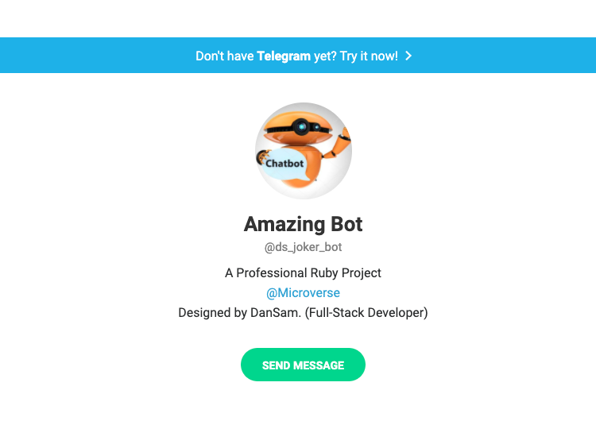

# Microverse Ruby Capstone Project

## Telegram Bot (Amazingbot)

- This Telegram Bot has being built implementing  Ruby And [Telegram bot API](https://core.telegram.org/bots/api)
- simply search for 'Amazingbot', Chosen bot or @ds_joker_bot.
- This bot behaves in accepting  commands and returning jokes, quotes or programming jokes and mood concerning programming at random.

 

## Built With

- Ruby
- Telegram API
- Rspec
- VsCode

## Commands to Run the Bot
This Bot has 6 commands
- [x] /info - Gives you a brief information about the both and how to interract with the bot
- [x] /start - It gives the instruction on  how to use othe commands to get the your info.
- [x] /quit  - persuades you not to quit".
- [x] /programmingjoke - It gives you a random selected programming joke related to any topic of programming.
- [x] /quotes - It gives a random quote related to programming.
- [x] /normaljoke - It gives a random quote related to programming.

### How to Run Tests

- You need to run 
```
$ gem install rspec on your system using any code editor of your choice or your terminal
```
- then run
```
$ bundle install or bundle
```
- you can run tests by running "rspec" in your terminal
```
$ rspec  and see all test cases with rspec passes
```

## Install and Run the Bot Locally

In order to run the Bot, you need to install RUBY in your computer. For windows you can go to [Ruby installer](https://rubyinstaller.org/) and for MAC and LINUX you can go to [Ruby official site](https://www.ruby-lang.org/en/downloads/) for intructions on how to intall it.

## When you have Ruby Installed in your System, please follow bellow mentioned steps to run the Bot

**Step 1**<br>
Clone the repo in your local folder where you want to run it<br>
`https://github.com/DanSam5K/Ruby-Telegram-Bot.git`.<br>
**Step 2**<br>
After cloning cd into project folder <br>
`$ cd Ruby-Telegram-Bot`<br> 
create a `config.rb` in the project root directory You will need Telegram access Token API
create a variable inside the config.rb file  with name
` TELEGRAM_TOKEN = 'APIKEY' ` and asign your APIKEY to the variable<br>
then uncomment the `# require_relative '../config'` inside `dansam_bot.rb` file <br>
**Step 3**<br> 
Run `bundle install` to install the gems from the `Gemfile`.<br>
**Step 4**<br>
Run `bin/main.rb` to start the bot.<br>
**Step 5**<br>
You can use the commands defined in the [Available commands section](#Commands-to-Run-the-Bot) defined above.<br>

#### This Bot is Live Now. You can click [Here](https://t.me/ds_joker_bot) to Play with Bot

## Authors

👤 **Daniel Samuel**

- GitHub: [@DanSam5K](https://github.com/DanSam5K)
- Twitter: [@_dan_sam](https://twitter.com/_dan_sam)
- LinkedIn: [DanSam](https://www.linkedin.com/in/dansamuel/)

## 🤝 Contributing

- If you want to contribute or have a feature to add.
- Go to the repo
- Open a pull request
or
- Feel free with a click [issues page](https://github.com/Ruby-Telegram-Bot/issues).

Contributions, issues and feature requests are welcome!

## Show Your Support
Give a ⭐️ if you like this project!

## Acknowledgments

- Project inspired by Microverse Program

## 📝 License

This project is [MIT](https://mit-license.org/) licensed.

